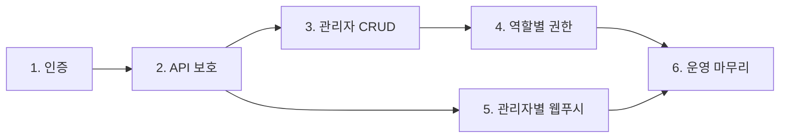

# 관리자 시스템 로드맵 — 4·5·6단계

> **작성 목적:** 1~3단계(인증, API 보호, 관리자 CRUD) 완료 이후, 나중에 참고하여 4~6단계를 진행하기 위한 문서입니다.

## 선행 완료 (1~3단계 요약)

| 단계 | 내용 | 상태 |
|------|------|------|
| **1** | JWT 로그인, Admin PWA 인증, Bearer API 호출, 역할별 메뉴 필터링 | ✅ 완료 |
| **2** | `/admin/*` API `AdminAuth` 보호, SSE 토큰 검증, 감사 로그(관리자 ID) | ✅ 완료 |
| **3** | `GET/POST/PATCH/DELETE /api/admin/users` (owner 전용), PWA 「관리자 관리」 | ✅ 완료 |

**기본 관리자:** `ops@bluecom.local` (owner) — `ADMIN_BOOTSTRAP_PASSWORD` 환경변수

---

## 전체 진행 순서



- **최소 MVP:** 1 → 2 → 3 (완료)
- **실무 사용:** 여기에 **4(권한)** + **5(푸시)**
- **프로덕션 안정화:** **6**까지

---

## 4단계 — 역할별 권한 (RBAC)

### 목표

역할(`owner` / `manager` / `operator` / `accounting` / `viewer`)에 따라 **메뉴·API·버튼** 접근을 분리한다.

### 역할 정의

| 역할 | 라벨 | 예시 권한 |
|------|------|-----------|
| `owner` | 최고관리자 | 전체 + 관리자 CRUD + DB reset/purge |
| `manager` | 운영관리자 | 작업·속기사·회원·정산 (관리자 CRUD 제외) |
| `operator` | 운영담당 | 작업 배정·편집·문의 |
| `accounting` | 회계담당 | 매출·정산·집계 위주 |
| `viewer` | 조회전용 | 조회만 |

### 현재 상태 (4단계 착수 시점)

| 항목 | 상태 |
|------|------|
| PWA 메뉴 숨김 (`canAccessMenu`) | ✅ 1단계에 포함 |
| `/api/admin/users` owner 보호 | ✅ 3단계 (`require_admin_permission("menu:admins")`) |
| `require_admin_permission()` 헬퍼 | ✅ `app/dependencies/admin_auth.py` |
| `has_permission()` / `MENU_PERMISSIONS` | ✅ `app/services/admin_permissions.py` |
| `action:*` 권한 체계 | ❌ 미구현 |
| 나머지 admin API 역할별 보호 | ❌ `AdminAuth`만 (로그인 확인) |
| PWA 버튼/액션 단위 제어 | ❌ 메뉴 안 버튼 대부분 전원 노출 |

### 작업 목록

#### 1. 권한 매트릭스 확정 (팀 합의)

`menu:*` 외에 `action:*` 권한을 정의한다. 아래는 **초안**이며, 구현 전 팀에서 확정할 것.

| 권한 키 | 허용 역할 (초안) | 대상 |
|---------|------------------|------|
| `menu:*` | (기존 `MENU_PERMISSIONS` 참고) | 사이드바 메뉴 |
| `action:job_assign` | owner, manager, operator | 작업/프로젝트 배정 |
| `action:job_status` | owner, manager, operator | 작업 상태 변경 |
| `action:job_transcript_edit` | owner, manager, operator | 초벌 편집·AI 초벌·전달 |
| `action:job_inquiry_reply` | owner, manager, operator | 문의 답변 |
| `action:member_edit` | owner, manager, operator | 회원 정보 수정 |
| `action:transcriber_manage` | owner, manager | 속기사 CRUD·등급·로그인 초기화 |
| `action:settlement_manage` | owner, manager, accounting | 정산/청구 상태 변경 |
| `action:settlement_pay` | owner, manager, accounting | 정산 지급 |
| `action:maintenance` | owner | DB reset, purge, 마이그레이션 |

#### 2. 백엔드 — `admin_permissions.py` 확장

- `ACTION_PERMISSIONS: dict[str, tuple[AdminRole, ...]]` 추가
- `has_permission()`에서 `action:*` 처리 (owner는 `*`로 전체 허용)
- `permissions_for_role()`이 `action:*` 목록도 JWT `/me` 응답에 포함되도록 확장 (PWA에서 사용)

**동기화 필수:** `admin/src/permissions.ts`에 동일 매트릭스 반영 (주석에 이미 명시됨)

#### 3. 백엔드 — 엔드포인트별 `require_admin_permission` 적용

현재 `AdminAuth`만 쓰는 주요 엔드포인트 (`app/routers/jobs.py`):

| 메서드 | 경로 | 권장 권한 |
|--------|------|-----------|
| GET | `/admin/overview` | 메뉴 접근 역할 (또는 viewer+) |
| GET | `/admin/events` | 인증된 관리자 (SSE) |
| POST/DELETE | `/admin/push-subscriptions` | 인증된 관리자 |
| GET | `/admin/transcribers`, `/admin/members` | 해당 메뉴 역할 |
| PATCH | `/admin/members/{id}` | `action:member_edit` |
| POST | `/admin/jobs/{id}/assign` | `action:job_assign` |
| GET | `/admin/jobs/{id}` | jobs 메뉴 역할 |
| GET/POST | `/admin/jobs/{id}/inquiries/*` | 조회: viewer+, 작성: `action:job_inquiry_reply` |
| PUT | `/admin/jobs/{id}/transcript` | `action:job_transcript_edit` |
| POST | `/admin/jobs/{id}/ai-draft`, `deliver-draft` | `action:job_transcript_edit` |
| POST/PATCH/DELETE | `/admin/transcribers/*` | `action:transcriber_manage` |
| GET/POST/DELETE | `/admin/transcriber-grade-rates/*` | `action:transcriber_manage` |
| POST | `/admin/settlements/*/status`, `payment` | `action:settlement_manage` / `action:settlement_pay` |
| POST | `/admin/invoices/*/status` | `action:settlement_manage` |
| POST | `/admin/maintenance/*` | `action:maintenance` (owner) |

**주의:** `POST /{job_id}/status`는 `OptionalAdminAuth` — 관리자 PWA에서 호출 시 반드시 `action:job_status` 검증 추가.

**이미 적용됨:** `app/routers/admin_users.py` → `require_admin_permission("menu:admins")`

#### 4. PWA — 버튼/액션 단위 제어

`admin/src/permissions.ts`에 `canPerformAction(role, action)` 추가 후 `App.tsx`에서 사용:

- 배정·재배정 버튼 → `action:job_assign`
- 정산 지급·상태 변경 → `action:settlement_*`
- 속기사 추가/수정/삭제/로그인 초기화 → `action:transcriber_manage`
- 초벌 편집·AI 생성·전달 → `action:job_transcript_edit`
- DB reset/purge (있다면) → `action:maintenance`

권한 없을 때: 버튼 **숨김** 또는 **비활성** (팀 정책에 따라 선택, API 403은 필수)

#### 5. 문서

역할–기능 매트릭스 1장을 팀 합의용으로 유지 (본 문서의 초안을 확정본으로 갱신)

### 완료 기준

- `viewer`로 로그인 시 정산 지급·DB reset·작업 배정 등 **쓰기 작업 불가** (API 403 + UI에서 버튼 없음)
- `accounting`은 매출/정산 메뉴는 가능, 작업 배정은 불가
- `operator`는 작업·문의는 가능, 속기사 삭제·관리자 CRUD는 불가

### 주요 파일

| 영역 | 파일 |
|------|------|
| 권한 매트릭스 (백엔드) | `app/services/admin_permissions.py` |
| 권한 매트릭스 (PWA) | `admin/src/permissions.ts` |
| Dependency | `app/dependencies/admin_auth.py` |
| Admin API | `app/routers/jobs.py`, `app/routers/admin_users.py` |
| Admin PWA | `admin/src/App.tsx` |

### 작업량 감

**중~대** — 정책 합의 + 메뉴/API/PWA 이중 적용

---

## 5단계 — 관리자별 웹푸시

### 목표

알림이 “기본 1명”이 아니라 **로그인한 관리자 각자**의 구독 기기로 전달된다.

### 현재 상태 (5단계 착수 시점)

| 항목 | 상태 |
|------|------|
| `admin_push_subscriptions` 테이블·upsert | ✅ `app/services/web_push.py` |
| 구독 API (`POST/DELETE /admin/push-subscriptions`) | ✅ `get_current_admin()` 기준 저장 |
| PWA 「관리자 알림 받기」 UI | ✅ `admin/src/App.tsx`, `admin/src/webPush.ts` |
| 발송 (`broadcast_admin_web_push`) | ✅ 활성 관리자 **전원** fan-out |
| 역할별 알림 필터 | ❌ 미구현 |
| 구독한 관리자만 발송 (비구독자 제외) | ✅ `send_web_push_to_admin`이 구독 없으면 0건 |

### 작업 목록

#### 1. 발송 정책 확정

예시 정책 (팀에서 선택):

| 이벤트 | 수신 역할 (예시) |
|--------|------------------|
| 의뢰인/속기사 문의 | owner, manager, operator |
| 검토 요청 | owner, manager, operator |
| 신규 회원 가입 | owner, manager |

#### 2. 백엔드 — 역할 필터 fan-out

`broadcast_admin_web_push()`를 확장:

```python
def broadcast_admin_web_push(
    db: Session,
    payload: dict[str, Any],
    *,
    roles: tuple[AdminRole, ...] | None = None,  # None이면 전체 활성 관리자
) -> int:
    ...
```

`send_admin_inquiry_web_push`, `send_admin_review_request_web_push`, `send_admin_member_signup_web_push`에서 역할 필터 전달.

#### 3. PWA — 구독 UX 보완

- 로그인 후 구독 상태 동기화 (재방문 시)
- 「알림 해제」 버튼 명시
- 권한 거부(`denied`) 시 안내 문구 (일부 구현됨)

#### 4. SSE (선택)

`/admin/events`와 웹푸시 이벤트 종류를 맞춰, PWA 실시간 갱신과 알림 정책을 일관되게 유지.

### 완료 기준

- A·B 두 관리자가 각각 브라우저에서 구독 → 문의 시 **둘 다** (또는 정책상 해당 역할만) 푸시 수신
- `accounting` 등 문의 담당이 아닌 역할은 문의 푸시 **미수신** (정책 적용 시)

### 주요 파일

| 영역 | 파일 |
|------|------|
| 웹푸시 서비스 | `app/services/web_push.py` |
| 알림 트리거 | `app/routers/jobs.py`, `app/routers/member_auth.py` |
| PWA | `admin/src/webPush.ts`, `admin/src/App.tsx`, `admin/public/admin-push-sw.js` |
| 설정 | `app/config.py` (`WEB_PUSH_*`) |

### 작업량 감

**소~중** — broadcast 기반은 이미 있음, 역할 필터·UX 보완 위주

### 참고 환경변수 (Railway)

```
WEB_PUSH_ENABLED=true
WEB_PUSH_VAPID_PUBLIC_KEY=...
WEB_PUSH_VAPID_PRIVATE_KEY=...
WEB_PUSH_SUBJECT=mailto:ops@example.com
PUBLIC_ADMIN_URL=https://record-admin.netlify.app
```

---

## 6단계 — 운영·보안 마무리

### 목표

프로덕션에 안전하게 운영할 수 있도록 설정·정책·감사를 마무리한다.

### 작업 목록

| 작업 | 내용 | 현재 상태 |
|------|------|-----------|
| **VAPID** | Railway에 `WEB_PUSH_*` 설정, `/api/config`에서 public key 노출 확인 | ⚠️ 환경별 설정 필요 |
| **초기 비밀번호** | owner 최초 로그인 후 비밀번호 변경 유도 UI/플래그 | ❌ 미구현 |
| **JWT 만료·갱신** | `JWT_EXPIRE_MINUTES` 정책 확정 (member/transcriber와 동일 패턴) | ⚠️ `jwt_expire_minutes=0`이면 무제한 |
| **last_login_at** | 로그인 시 갱신 | ✅ `app/services/admin_auth.py` |
| **감사 로그** | 상태 변경·문의·배정에 `changed_by_admin_id` 등 | ✅ 2단계에서 대부분 반영 |
| **관리자 활동 로그** (선택) | 별도 `admin_audit_log` 테이블 | ❌ 미구현 |
| **배포 전환** | 로그인 필수 전환 공지, 1회 배포 체크리스트 | ❌ 문서화 필요 |

### 완료 기준

- 프로덕션에서 웹푸시·JWT·초기 비밀번호 정책이 문서화되어 운영 가능
- 관리자 계정 추가·역할 변경·비활성화 흐름이 운영 매뉴얼 수준으로 정리됨

### 배포 체크리스트 (초안)

- [ ] `JWT_SECRET` 프로덕션 전용 값 설정
- [ ] `ADMIN_BOOTSTRAP_PASSWORD` 최초 배포 후 변경 또는 비활성화
- [ ] `WEB_PUSH_*` + `PUBLIC_ADMIN_URL` 설정
- [ ] Netlify Admin PWA `VITE_API_BASE` → Railway API URL
- [ ] owner 외 테스트 계정( viewer, operator 등)으로 4단계 권한 스모크 테스트
- [ ] 2명 이상 관리자로 5단계 푸시 스모크 테스트

### 작업량 감

**소** — 대부분 설정·문서·소규모 UX

---

## 구현 시 권장 순서

1. **4단계** — 역할 매트릭스 합의 → 백엔드 `action:*` → API 적용 → PWA 버튼
2. **5단계** — 3단계(여러 계정) 이후 의미 큼; 4단계 역할과 연동해 알림 수신 역할 정의
3. **6단계** — 4·5 완료 후 프로덕션 배포 직전

---

## 메뉴 권한 참고 (현재 정의)

`app/services/admin_permissions.py` ↔ `admin/src/permissions.ts` 동기화 유지.

| 메뉴 키 | 허용 역할 |
|---------|-----------|
| `dashboard` | 전체 |
| `jobs` | owner, manager, operator, viewer |
| `transcribers` | owner, manager, viewer |
| `members` | owner, manager, operator, viewer |
| `progress` | 전체 |
| `sales` | owner, manager, accounting |
| `reports` | owner, manager, accounting, viewer |
| `analytics` | owner, manager, accounting, viewer |
| `admins` | owner |

---

## 관련 URL·환경 (참고)

| 항목 | 값 |
|------|-----|
| Admin PWA | https://record-admin.netlify.app |
| API | https://record-production.up.railway.app |
| 기본 owner | `ops@bluecom.local` |

---

*마지막 갱신: 2026-06-19 — 1~3단계 완료 기준*
