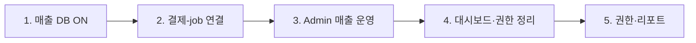

# 매출 관리 로드맵 (수입만)

> **작성 목적:** 선결제 기준으로 의뢰인 결제 → DB 저장 → Admin 매출 조회까지의 단계를 정리한 문서입니다.  
> **범위:** 매출(수입)만. 지출(속기사 정산 등)은 별도 **지출관리** 로드맵에서 진행합니다.

**마지막 갱신:** 2026-06-19

---

## 전제

- **선결제:** 결제 완료 후에만 업로드 (미수금·후불 관리 없음)
- **앞단 완료:** 견적 → 포트원 결제 → 파일 업로드 → job 생성
- **이번 범위:** 의뢰인 결제 → DB → Admin 매출 조회
- **제외:** 정산, 속기사 지급, `settlements`, 마진·지출 리포트

---

## 화면 역할 분리 (확정)

| 화면 | 역할 | 매출·금액 |
|------|------|-----------|
| **대시보드** | 등급별 **운영** 현황 (배정·진행·작업 건수) | ❌ **노출 금지** |
| **매출 관리** | 결제·매출 조회 | ✅ 여기서만 |
| **집계/분석** (`reports`, `analytics`) | 회계·통계 (나중에 확장) | ✅ 권한 있는 역할만 |

**대시보드 ≠ 회계 화면.**  
`operator` / `viewer`는 대시보드만 봐도 **금액이 보이면 안 됨.**

### 등급별 대시보드 (방향)

| 역할 | 대시보드에 보일 것 |
|------|-------------------|
| `owner` / `manager` | 배정 대기, 작업 중, PDF 완료, 문의 등 **운영 지표** |
| `operator` | 담당 작업·배정·문의 위주 |
| `accounting` | 대시보드 최소화 또는 **매출 메뉴로 바로** (금액 카드 없음) |
| `viewer` | 조회용 운영 요약만 |

**현재 코드 (제거 대상):** 대시보드에 `이번 달 매출 예정`, `정산 예정`, `미수 금액` StatCard

---

## 전체 진행 순서

---

## 1단계 — 매출 DB 저장 (설정)

**목표:** 결제가 `payment_records`에 쌓임

| 작업 | 내용 |
|------|------|
| Railway | `PAYMENT_RECORDS_ENABLED=true` |
| 확인 | `PORTONE_*` 결제 설정 정상 |
| 검증 | 결제 1건 → DB `payment_records` 1행 |
| 검증 | Admin **매출 관리**에 1건 표시 |

**완료 기준:** 결제하면 매출 목록에 남음 (job 연결은 아직 없어도 됨)

**주의:** 대시보드 API/UI는 이 단계에서 변경하지 않음. 조회는 **매출 관리** 메뉴에서만.

---

## 2단계 — 결제 ↔ job 연결 (핵심 개발)

**목표:** 결제와 업로드 파일(job)이 1:1(또는 1:N)로 묶임 — “누가, 얼마, 어떤 파일”이 한 줄로 이어짐

| 작업 | 내용 |
|------|------|
| DB | `payment_records`에 `job_id` / `project_id` 등 연결 필드 |
| 업로드·결제 완료 시 | 결제 ID·금액을 job 생성과 함께 저장 |
| job | `sales_amount` = 결제 금액, `payment_status = paid` (선결제 고정) |
| Admin **의뢰/파일** | 금액·결제완료 표시 — `owner` / `manager` / `accounting`만 (RBAC) |
| Admin **매출 관리** | 해당 job/프로젝트로 이동·대조 가능 |
| 대시보드 | job 목록에 **금액 컬럼 노출 안 함** |

**완료 기준:** 매출 관리 1건과 해당 job/파일을 Admin에서 추적 가능

---

## 3단계 — Admin 매출 관리 운영화

**목표:** 회계 담당이 일상적으로 쓰는 화면

| 작업 | 내용 |
|------|------|
| 활용 | 결제건수, 금액, 의뢰인, 주문명, 결제일 (기존 UI) |
| 보완(선택) | 기간 필터, 검색, job/프로젝트 링크, CSV |
| 안 함 | 미수금, 후불, 입금 대기 |

**완료 기준:** 월별 “얼마 들어왔는지” Admin **매출 관리** 메뉴만으로 확인 가능

**원칙:** 모든 매출 조회는 **매출 관리**(＋나중 집계/분석)에서만.

---

## 4단계 — 대시보드·권한 정리 (UI 정책 반영)

**목표:** 대시보드는 운영만, 매출 숫자는 회계 메뉴에서만

| 작업 | 내용 |
|------|------|
| 대시보드 | 매출·정산·미수 StatCard **삭제** |
| 대시보드 | 배정 대기, 작업 중, 완료 건수 등 **운영 지표만** |
| `reports` / `analytics` | 매출·통계는 **회계 권한** 메뉴로 유지 |
| API | overview에서 `operator`/`viewer`에게 `sales`·금액 필드 **미전달** (RBAC 4단계) |
| 메뉴 | `accounting` → 기본 진입 `sales` 또는 `reports` 검토 |
| 정리 | `outstanding`(미수금) 제거 또는 숨김 — 선결제라 불필요 |
| 정리 | job `unpaid` 전제 UI 정리 |

**완료 기준:** 대시보드에 금액 없음, 매출 합계는 `payment_records` 기준으로 **매출 관리**와 일치

---

## 5단계 — 권한·리포트 (매출만, 나중)

| 작업 | 내용 |
|------|------|
| RBAC | `accounting` / `manager` / `owner`만 **매출 관리** |
| API | 매출 관련 엔드포인트에 `require_admin_permission` 적용 |
| 리포트 | 월별·일별 매출, 의뢰인별 합계 (선택) |
| (선택) | 포트원 웹훅으로 결제 누락 방지 |

---

## 지금 / 나중

| **지금 (매출)** | **나중 (지출관리)** |
|-----------------|---------------------|
| `payment_records` | `settlements` |
| 매출 관리 메뉴 | 지출 관리 메뉴 |
| 대시보드에서 금액 제거 | 정산·지급 UI |
| 결제 ↔ job 연결 | 속기사 등급 요율, PDF 후 정산 자동 생성 |
| | 마진·지출 리포트 |

---

## 의도적으로 빼는 것 (선결제)

- 미수금·후불·`unpaid` 운영
- `partial_paid`·수동 입금 확인
- 청구서·독촉 (B2B 요구 전까지)
- 대시보드 매출·정산 금액 노출

---

## 단계별 “지금 할 일” 요약

| 단계 | 성격 | 내용 |
|------|------|------|
| **1** | 설정 | Railway `PAYMENT_RECORDS_ENABLED=true` |
| **2** | 개발 | 결제–job 연결 (**가장 중요**) |
| **3** | UI 보완 | 매출 화면 job 링크, 필터 등 |
| **4** | 정리 | 대시보드 금액 카드 제거, API 필터 |
| **5** | 마무리 | 권한·리포트 |

**다음 액션:** 1단계 설정 → 바로 2단계 개발

---

## 관련 코드·설정

| 영역 | 파일 / 설정 |
|------|-------------|
| 매출 DB | `payment_records` 테이블, `scripts/migrate_payment_records.sql` |
| 결제 저장 | `app/services/job_store.py` — `record_payment_record()` |
| 환경변수 | `PAYMENT_RECORDS_ENABLED`, `PORTONE_*` (`.env.example` 참고) |
| Admin 매출 UI | `admin/src/App.tsx` — `sales` 메뉴 |
| 메뉴 권한 | `app/services/admin_permissions.py`, `admin/src/permissions.ts` |
| RBAC 로드맵 | [`docs/admin-roadmap-phase-4-6.md`](./admin-roadmap-phase-4-6.md) |

### 메뉴 권한 (현재 정의)

| 메뉴 키 | 허용 역할 |
|---------|-----------|
| `sales` | owner, manager, accounting |
| `reports` | owner, manager, accounting, viewer |
| `analytics` | owner, manager, accounting, viewer |

---

## 돈 흐름 참고 (3갈래)

| 구분 | 의미 | DB/화면 | 이번 범위 |
|------|------|---------|-----------|
| **매출(수입)** | 의뢰인 업로드 전 결제 | `payment_records` → **매출 관리** | ✅ |
| **작업 단위 금액** | 파일(job)별 청구·결제 상태 | `jobs.sales_amount`, `payment_status` | ✅ (2단계에서 연결) |
| **정산(지출)** | 속기사 지급 | `settlements` → 속기사 화면 | ❌ 나중 |

---

*관련: [`admin-roadmap-phase-4-6.md`](./admin-roadmap-phase-4-6.md) — 4단계 RBAC, `sales` 메뉴 권한*
