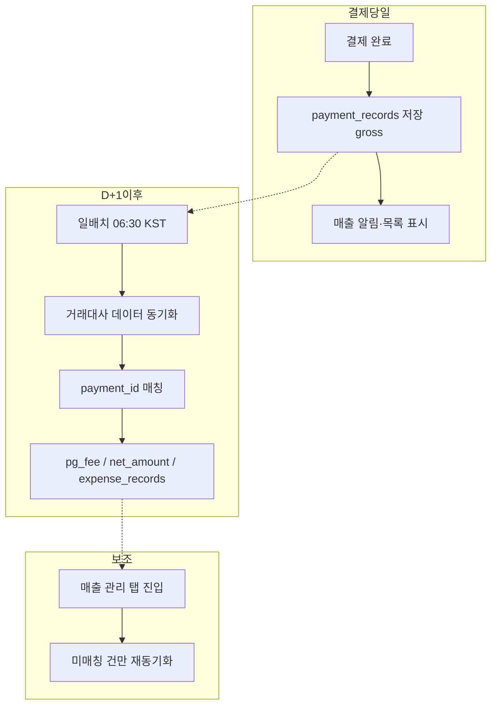

# 수수료 자동 입력

> **작성 목적:** PG 결제 수수료를 지출로 자동 반영하기 위한 설계·운영 방식을 정리한 문서입니다.  
> **범위:** 일반 가맹점 PG 수수료(카드·간편결제 등). 파트너 정산(`/platform/*`)·속기사 지급(`settlements`)은 별도.

**마지막 갱신:** 2026-06-20

**관련 문서:** [`sales-roadmap.md`](./sales-roadmap.md) (매출 관리)

---

## 전제

- **우리 모델:** 일반 쇼핑몰(단일 가맹점). 의뢰인 결제 → PG 수수료 차감 → 우리 회사 입금.
- **매출(수입):** 결제 완료 시 `payment_records.amount` = 고객 결제 **총액(gross)**. 이미 구현·운영 중.
- **지출(PG 수수료):** PG사가 부과. PortOne 결제 API(`GET /payments/{paymentId}`) 응답에 **수수료 없음**.
- **수수료 확정 시점:** PG 마감 후. PortOne **거래대사** 데이터 기준 **D+1 전후** (일별 갱신).

---

## PortOne에서 수수료를 아는 방법

| 방식 | 건별 PG 수수료 | 비고 |
|------|----------------|------|
| `GET /payments/{id}` | ❌ | 결제액만. 매출 저장용 |
| `/platform/*` 파트너 정산 API | ❌ (용도 다름) | 입점 파트너 분배용 |
| **PG 거래대사** (콘솔·API·엑셀) | ✅ | 포트원 거래번호·PG 수수료·정산금액 |
| REST `payment-reconciliations/*/vat-report` | △ | 부가세 **집계** 위주. 건별 fee 연동은 스펙 추가 확인 필요 |

**거래대사:** PortOne에 저장된 우리 결제 데이터와 PG사 거래·정산 데이터를 1:1로 맞춘 결과.  
콘솔: **정산 관리 → 통합 PG 정산 / PG 거래대사**.

건별 확인 항목 예:

- 포트원 거래번호 (`payment_id` 매칭 키)
- 거래 금액, PG 수수료, PG 수수료 부가세, 정산 금액
- 대사 상태 (일치 / 불일치 / 불능 / 수집전거래)

---

## 확정 방식: 일배치 + 매출 관리 탭(보조)

### 1. 일배치 (본방)

| 항목 | 내용 |
|------|------|
| **시각** | 매일 **06:30 KST** (PG 마감·PortOne 전일 데이터 반영 이후) |
| **Railway cron (UTC)** | `30 21 * * *` |
| **대상** | `pg_fee` 미확정 `payment_records` (최근 **14~30일**) |
| **동작** | 거래대사 데이터 조회 → `payment_id` 매칭 → 수수료·실입금·지출 upsert |
| **멱등** | 동일 `payment_id` 재실행 시 덮어쓰기만 (중복 지출 방지) |

**선택:** 주 1회(월 07:00 KST) 최근 30일 전체 재동기화 — 누락·취소·지연 정산 보완.

### 2. 매출 관리 탭 진입 (보조)

| 항목 | 내용 |
|------|------|
| **시점** | Admin **매출 관리** 메뉴 진입 시 |
| **대상** | 미매칭·미동기화 건만 (전체 풀 스캔 X) |
| **목적** | 배치 전 당일 확인, 배치 실패·누락 보완 |
| **스로틀** | 예: 동일 상점 **5분에 1회** 이하 (과도한 API 호출 방지) |

**결제 finalize 시점에는 수수료 동기화하지 않음.**

---

## DB·지출 반영 (구현 예정)

### `payment_records` 확장

| 컬럼 | 설명 |
|------|------|
| `pg_fee` | PG 수수료 (VAT 별도 컬럼 또는 합산 정책 확정) |
| `pg_fee_vat` | PG 수수료 부가세 (선택) |
| `net_amount` | 정산(실입금) 금액 |
| `fee_synced_at` | 수수료 동기화 완료 시각 |
| `fee_sync_status` | `pending` / `synced` / `failed` / `manual` |

### `expense_records` (지출관리)

| 필드 | 예시 |
|------|------|
| `category` | `pg_fee` |
| `source_type` | `payment_record` |
| `source_id` | `payment_id` |
| `amount` | `pg_fee + pg_fee_vat` (정책에 따라 분리 가능) |
| `expense_date` | **거래일(결제일)** 권장 (당월 매출과 같은 달 지출) |

**유니크:** `(category, source_type, source_id)` — 배치·탭 재실행 시 upsert.

### 속기사 지급과 구분

| 지출 | 트리거 |
|------|--------|
| **PG 수수료** | 거래대사 **일배치** + 매출 탭 보조 |
| **속기사 정산** | Admin 정산 **지급 완료** 시 이벤트 (cron 불필요) |

---

## Admin UI

**매출 관리** 테이블 예시:

| 결제일 | 의뢰인 | 주문명 | 매출 | PG 수수료 | 실입금 | 상태 |
|--------|--------|--------|------|-----------|--------|------|
| 06-19 | 홍길동 | 프로젝트A | 110,000 | — | — | 동기화 대기 |
| 06-18 | 김철수 | 프로젝트B | 66,000 | 1,980 | 64,020 | 확정 |

- 매출 발생 알림·SSE: **gross 금액** 유지 (수수료 확정 전 값).
- 수동 입력 UI: API/엑셀 누락·보정용만 (일상 운영 필수 아님).

---

## 인프라

### Railway cron (별도 서비스 권장)

- API 서버 lifespan 루프 **사용 안 함** (재시작·중복 실행 위험).
- 예: `python scripts/sync_pg_fee_expenses.py` 실행 후 **exit**.
- `railway.toml` 또는 콘솔 Cron Schedule에 등록.

### 환경변수 (예정)

| 변수 | 용도 |
|------|------|
| `PG_FEE_SYNC_ENABLED` | 배치·탭 동기화 ON/OFF |
| `PG_FEE_SYNC_CRON_SECRET` | 내부 sync 엔드포인트 보호 (cron → API 호출 시) |
| `PORTONE_API_SECRET` | 기존 결제용 시크릿 (거래대사 API 동일 인증 여부 확인) |

### PortOne 콘솔 선행 조건

- [ ] **정산 조회 동의** (동의 다음 날부터 데이터 이용)
- [ ] 사용 PG별 **정산 API 키** (예: 네이버페이)
- [ ] 거래대사 **건별 API** 엔드포인트·필드 스펙 PortOne 확인 (REST vs 엑셀 import 대체)

---

## 구현 순서 (권장)

| 단계 | 내용 | 의존 |
|------|------|------|
| **1** | PortOne 거래대사 API/엑셀 스펙 확정 | — |
| **2** | DB 마이그레이션 (`pg_fee`, `expense_records` 등) | 1 |
| **3** | `sync_pg_fee_expenses` 서비스 + 멱등 upsert | 2 |
| **4** | Railway 일배치 cron | 3 |
| **5** | 매출 관리 탭 진입 시 미매칭 재동기화 | 3 |
| **6** | 매출 UI 수수료·실입금·상태 컬럼 | 5 |

**타이밍:** [`sales-roadmap.md`](./sales-roadmap.md) **2단계(결제–job 연결)** 완료 후, 지출관리 메뉴와 함께 또는 직후.

---

## 하지 않는 것

- 결제 완료 API 응답에서 수수료 실시간 추출
- `/platform/partner-settlements`로 PG 카드 수수료 조회
- 매출 관리 탭마다 전 기간 전체 재동기화 (부하·Rate limit)
- 수수료 미확정 건을 확정 매출처럼 회계 확정 처리

---

## 참고 링크

- [PortOne PG 거래대사 가이드](https://developers.portone.io/opi/ko/etc/recon.md)
- [PortOne 관리자콘솔 PG 거래대사](https://help.portone.io/category/admin-console/pg-settlement)
- [PortOne 대사 서비스 REST API](https://developers.portone.io/api/rest-v2/reconciliation?v=v2)
- 코드: `app/routers/member_auth.py` (`_finalize_portone_payment`), `app/services/job_store.py` (`record_payment_record`)
